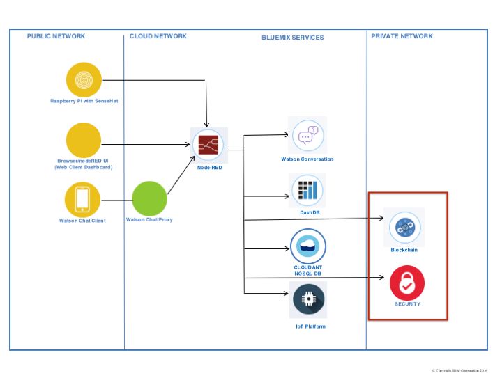

  
# Workshop 3: Blockchain

## Architecture
 In this lab, we continue building on the existing architecture. In prior labs, you configured your Raspberry Pi with Sens HAT to talk to Watson IoT Foundation running on Bluemix. You grew your interaction by integrating NodeRed and the Watson Conversation service also both running on Bluemix. Your cloud environment will expand to a hybrid cloud by talking with a blockchain network. The Hyperledger V1 Fabric is running on a private server in a secured network. 

In this lab, NodeRed will communicate with the Hyperledger Fabric through APIs. NodeRed will also facilitate communication between the ledger and [Weather.com](https://twcservice.mybluemix.net/rest-api/).

## Application Overview
The blockchain workshop is intended to give you a basic understanding of how a developer would interact with Hyperledger Fabric. In this workshop you will use a Browser based UI to modify chaincode, test your code and deploy your changes. You will also learn how tooling can take the code and generate API to allow for application integration through a REST-ful interface. 

This lab will be broken into two parts: creating chaincode and generating API and using NodeRed to test API integration.

### Terminology
With blockchain, many words are used interchangeably. This section is an attempt to decode them and show how they are related.

**ledger:** an account book of final entry where business transactions are recorded. A ledger is typically associated with accounts. In this case, the concept remains the same but for business in general, not just finance.

**blockchain:** a decentralized, distributed ledger that records transactions between participants in a network. 

**block:** An ordered set of transactions that is cryptographically linked to the preceding block(s) on a channel.

**chain:** The chain of the ledger is a transaction log structured as hash-linked blocks of transactions. Peers receive blocks of transactions from the ordering service, mark the block?s transactions as valid or invalid based on endorsement policies and concurrency violations, and append the block to the hash chain on the peer?s file system.

**Hyperledger Fabric:** A particular implementation of blockchain technology. This implementation is built for business use. It is an open source project lead by the Linux Foundation. It is one project within the Hyperledger Project. For more information, visit the [Hyperledger Project page](http://www.hyperledger.org/).

**_Note:_** You will see blockchain, ledger, Hyperledger (referring to the fabric) and fabric used interchangeably. They are all referring to the concept of blockchain.

**Hyperledger Composer:** (Composer) an open development toolset and framework to make creating blockchain applications easier. The tooling can be used through a Command Line Interface (CLI) or through a web UI called Composer Playground. Each interface allows for developers to define the network in terms of participants, asset(s) and transactions.  Composer also includes the ability to run a rest server that uses Swagger to generate callable APIs to interact with chaincode. For more information: [Hyperledger Composer page](https://hyperledger.github.io/composer/introduction/introduction.html).

**asset:** something of value to participants in the network. They may be tangible or intangible goods, services or property.

**smart contract:** (contract) your terms for doing business in a blockchain network. Really, this is the conditions that a transaction can occur in. It may include checking for other specific information to allow the transaction to occur. In Composer terms, this is the logic that makes your transaction work.

**business network artifact:** When using Composer, the defined network of participants, assets and transactions can be exported to a packaging of files known as a business network artifact (.bna). 

**chaincode:** code written for blockchain. Typically this an application written in Go or NodeSDK. It now can also mean the same thing as your .bna. When you create your network and supporting logic in Composer, the entire package becomes your chaincode. 

**_Note:_** You may see chaincode, smart contract and transaction (in relation to Composer) used interchangably. They can refer to the same thing conceptually. In reality, chaincode == the business network artifact from Composer, transaction defines what is in a transaction (e.g. data, assets) and a smart contract is really the logic that is written to make a transaction actually happen in Composer.

## Project Repositories
**_TBD_

## Workshop Setup
To run this workshop you will need the following:
1. Webbrowser (tested with Firefox and Chrome)

## Workshop Instructions
### Scenario Overview
Your Raspberry Pi Sens HAT detects the temperature in the room or the temperature you create around it. In a real world scenario, this could be a temperature gauge in your house or in an office building. In this lab, we have a logical thermostat that only exists programatically in blockchain. This could be connected to a real thermostat like Nest via API. To keep family members, housemates, friends or children from excessively running air conditioning or heat, they must first find out if they have permission to adjust the thermostat by running a transaction defined in a smart contract running on Hyperledger Fabric. We will also add in the ability to consult current conditions via API from Weather.com to optimally set the thermostat.

### Part 1 - Working with Chaincode
In this section of the lab you will be working with Hyperledger Composer to create chaincode that could run on a blockchain network. We will create our code in the the Composer Playground, a browser based UI. The code has already been started and is stored in GitHub.

#### Defining your blockchain network
1. Open the GitHub [repository for this lab](https://github.com/SweetJenn23/BlockchainLab).
   

2. Select **stsa-temp-part1.bna**.
   

3. Click **Download**.
   

4. In a browser, go to the Composer Playground running on Bluemix. [https://composer-playground.mybluemix.net/editor](https://composer-playground.mybluemix.net/editor)
   

   ​

   * Explore Composer Playground.

     * Click **About** *(README.md)*: This is a text file designed to tell you about the code you are going to work with.

       ​

     * Select **Model File** *(models/org.acme.sample.cto)*: This is where you create your *model* `participants`, `assets` and `transactions`.

     

     ​

     * Select **Script File** *(lib/sample.js)*: This is where you write JavaScript to give functionality (logic) to your model. All of this together creates your chaincode.

       

       ​

     * Select **Access Control** *(permissions.acl)*: This allows you to control what permissions participants in the network have.

       

       ​

     * **Note:** All of these files together become part of your **.bna** (business network archive) once you deploy them. Business Network Archive is a file type created by Hyperledger Composer. You may also hear this refered to as business network definition.

       ​

     * Select **Add File**: This would allow you to add another file to the web UI. Click **Cancel**

       

       ​

     * At the top of the page, select **Test**.

       

       ​

     * Under the Test tab, you will be able to interact with your code after you've delected **Deploy** on the Define tab. As shown below, you see that you can create a participant based on specifications from your model file. We won't explore through more of these right now because we will be working with them closely later in the lab.

       

       ​

     * At the top of the page, select **Admin**.

       

       ​

     * The credentials that Composer Playground is using to access blockchain are stored here. From here you can also issue new credentials if you have authority.

       

       ​

     * The Composer Playground running on Bluemix is not currently connected to a blockchain environment. That's okay! The browser will simulate how things would work if connected to blockchain. In a Composer Playground connected to a blockchain, there will be a **globe** icon instead of **Get local version**. In that tab, you can create a connection profile with issued credentials to access specific blockchain networks where you would deploy your business network definition and interact with it.

       

     ​

5. Scroll down on the left side of the Composer Playground and select **Import/Replace**.
   

6. Click the **browse** link.
   

7. Navigate to where you downloaded the **stsa-temp-part1.bna** file, select the file and click **Open**.
   

8. From the _Import/Replace dialog window_, verify that your file shows it contains 1 asset, 0 participants and 3 transactions. Click **Deploy**.
   

9. On the warning box, _Current definition will be replaced_, accept the warning by clicking **Replace & Import**.
* <u>Note for Hyperledger Composer V0.7 - 0.9</u>: When you deploy your business network to Hyperledger Fabric, the business network name is used as the chaincode ID. If the business network name is changed then a new chaincode ID will be issued and used on deploy. All existing data in blockchain will be lost due to the change. 
    

10. ​