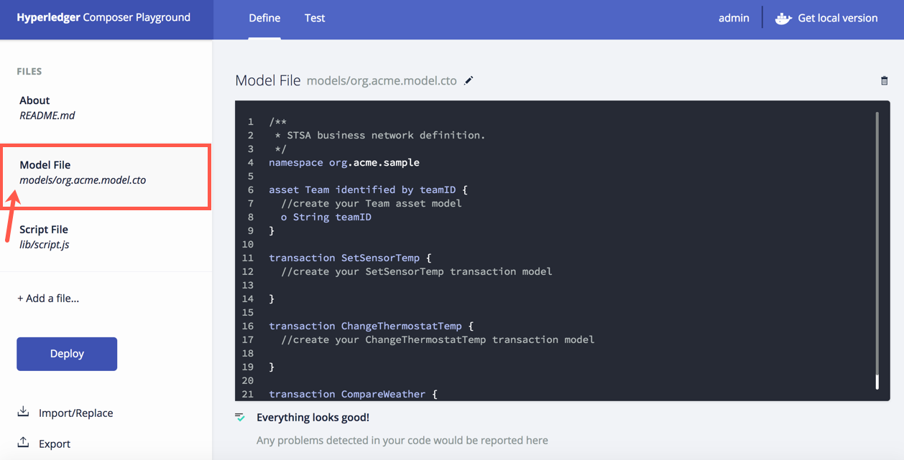
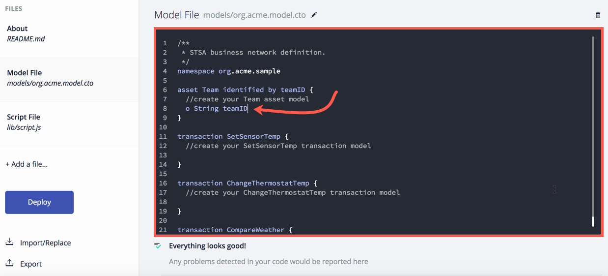
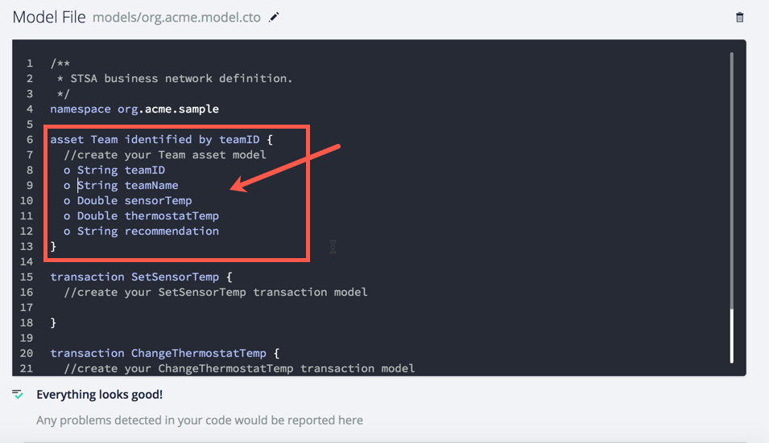
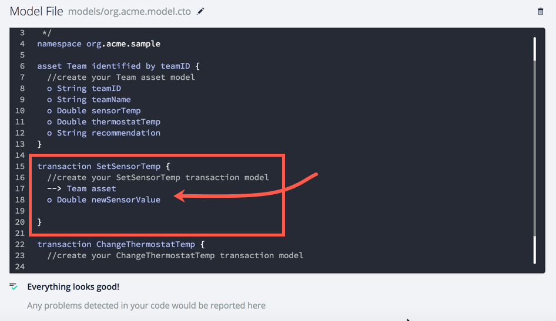
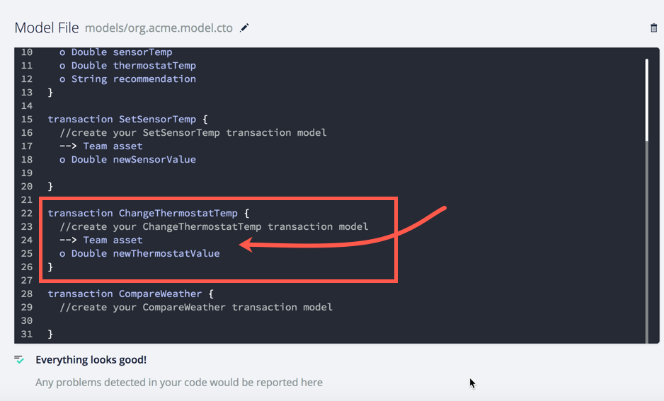
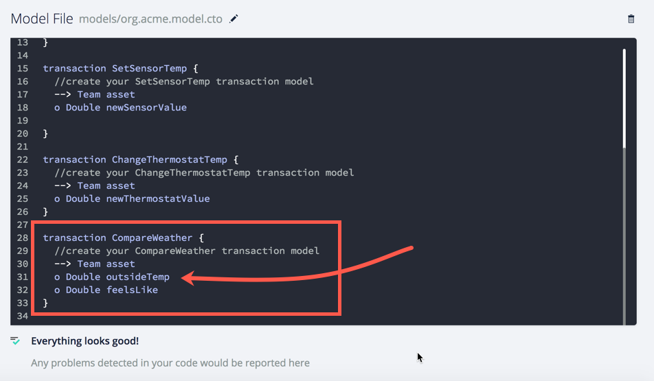
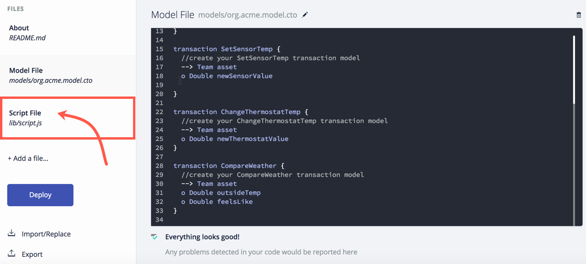
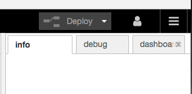

  
# Workshop 3: Blockchain

## Architecture
In this lab, we continue building on the existing architecture. In prior labs, you configured your Raspberry Pi with Sens HAT to talk to Watson IoT Foundation running on Bluemix. You grew your interaction by integrating NodeRed and the Watson Conversation service also both running on Bluemix. Your cloud environment will expand to a hybrid cloud by talking with a blockchain network. The Hyperledger V1 Fabric is running on a private server in a secured network. 

In this lab, NodeRed will communicate with the Hyperledger Fabric through APIs. NodeRed will also facilitate communication between the ledger and [Weather.com](https://twcservice.mybluemix.net/rest-api/).


## Application Overview
The blockchain workshop is intended to give you a basic understanding of how a developer would interact with Hyperledger Fabric. In this workshop you will use a Browser based UI to modify chaincode, test your code and deploy your changes. You will also learn how tooling can take the code and generate API to allow for application integration through a REST-ful interface. 

This lab will be broken into two parts: creating chaincode and generating API and using NodeRed to test API integration.

### Terminology
With blockchain, many words are used interchangeably. This section is an attempt to decode them and show how they are related.

**ledger:** an account book of final entry where business transactions are recorded. A ledger is typically associated with accounts. In this case, the concept remains the same but for business in general, not just finance.

**blockchain:** a decentralized, distributed ledger that records transactions between participants in a network. 

**block:** An ordered set of transactions that is cryptographically linked to the preceding block(s) on a channel.

**chain:** The chain of the ledger is a transaction log structured as hash-linked blocks of transactions. Peers receive blocks of transactions from the ordering service, mark the block's transactions as valid or invalid based on endorsement policies and concurrency violations, and append the block to the hash chain on the peer's file system.

**Hyperledger Fabric:** A particular implementation of blockchain technology. This implementation is built for business use. It is an open source project lead by the Linux Foundation. It is one project within Hyperledger Project. For more information, visit the [Hyperledger Project page](http://www.hyperledger.org/).

**_Note:_** You will see blockchain, ledger, Hyperledger (referring to the fabric) and fabric used interchangeably. They are all referring to the concept of blockchain.

**Hyperledger Composer:** (Composer) an open development toolset and framework to make creating blockchain applications easier. The tooling can be used through a Command Line Interface (CLI) or through a web UI called Composer Playground. Each interface allows for developers to define the network in terms of participants, asset(s) and transactions.  Composer also includes the ability to run a rest server that uses Swagger to generate callable APIs to interact with chaincode. For more information: [Hyperledger Composer page](https://hyperledger.github.io/composer/introduction/introduction.html).

**asset:** something of value to participants in the network. They may be tangible or intangible goods, services or property.

**smart contract:** (contract) your terms for doing business in a blockchain network. Really, this is the conditions that a transaction can occur in. It may include checking for other specific information to allow the transaction to occur. In Composer terms, this is the logic that makes your transaction work.

**business network artifact:** When using Composer, the defined network of participants, assets and transactions can be exported to a packaging of files known as a business network artifact (.bna). 

**chaincode:** code written for blockchain. Typically this is an application written in Go or NodeSDK. It now can also mean the same thing as your .bna. When you create your network and supporting logic in Composer, the entire package becomes your chaincode. 

**_Note:_** You may see chaincode, smart contract and transaction (in relation to Composer) used interchangably. They can refer to the same thing conceptually. In reality, chaincode == the business network artifact from Composer, transaction defines what is in a transaction (e.g. data, assets) and a smart contract is really the logic that is written to make a transaction actually happen in Composer.

## Project Repositories
**_TBD_

## Workshop Setup
To run this workshop you will need the following:
1. Webbrowser (tested with Firefox and Chrome)


## Workshop Instructions
### Scenario Overview
Your Raspberry Pi Sens HAT detects the temperature in the room or the temperature you create around it. In a real world scenario, this could be a temperature gauge in your house or in an office building. In this lab, we have a logical thermostat that only exists programatically in blockchain. This could be connected to a real thermostat like Nest via API. To keep family members, housemates, friends or children from excessively running air conditioning or heat, they must first find out if they have permission to adjust the thermostat by running a transaction defined in a smart contract running on Hyperledger Fabric. We will also add in the ability to consult current conditions via API from Weather.com to optimally set the thermostat.

### Part 1 - Working with Chaincode
In this section of the lab you will be working with Hyperledger Composer to create chaincode that could run on a blockchain network. We will create our code in the the Composer Playground, a browser based UI. The code has already been started and is stored in GitHub.

#### Defining your blockchain network
1. Open the GitHub [repository for this lab](https://github.com/SweetJenn23/BlockchainLab).
   


2. Select **stsa-temp-part1.bna**.
   


3. Click **Download**.
   


4. In a browser, go to the Composer Playground running on Bluemix. [https://composer-playground.mybluemix.net/editor](https://composer-playground.mybluemix.net/editor)

   * <u>Note:</u> You will need to view the browser in Full Screen (fully expanded) mode to be able to access everything and prevent issues with inability to scroll on certain screens.

   

   ​

   * Explore Composer Playground.

     * Click **About** *(README.md)*: This is a text file designed to tell you about the code you are going to work with.

       ​

     * Select **Model File** *(models/org.acme.sample.cto)*: This is where you create your *model* `participants`, `assets` and `transactions`.

     

     ​

     * Select **Script File** *(lib/sample.js)*: This is where you write JavaScript to give functionality (logic) to your model. All of this together creates your chaincode.

       

       ​

     * Select **Access Control** *(permissions.acl)*: This allows you to control what permissions participants in the network have.

       

       ​

     * **Note:** All of these files together become part of your **.bna** (business network archive) once you deploy them. Business Network Archive is a file type created by Hyperledger Composer. You may also hear this refered to as business network definition.

       ​

     * Select **Add File**: This would allow you to add another file to the web UI. Click **Cancel**

       

       ​

     * At the top of the page, select **Test**.

       

       ​

     * <u>Note:</u> Under the Test tab, you will be able to interact with your code after you've selected **Deploy** on the Define tab. As shown below, you see that you can create a participant based on specifications from your model file. We won't explore through more of these right now because we will be working with them closely later in the lab.

       

       ​

     * At the top of the page, select **Admin**.

       

       ​

     * <u>Note:</u> The credentials that Composer Playground is using to access blockchain are stored here. From here you can also issue new credentials if you have authority.

       

       ​

     * <u>Note:</u> The Composer Playground running on Bluemix is not currently connected to a blockchain environment. That's okay! The browser will simulate how things would work if connected to blockchain. In a Composer Playground connected to a blockchain, there will be a **globe** icon instead of **Get local version**. In that tab, you can create a connection profile with issued credentials to access specific blockchain networks where you would deploy your business network definition and interact with it.

       

     ​


5. Click back to the **Define** tab and scroll down on the left side of the Composer Playground to select **Import/Replace**.
   


6. Click the **browse** link.
   


7. Navigate to where you downloaded the **stsa-temp-part1.bna** file, select the file and click **Open**.
   


8. From the _Import/Replace dialog window_, verify that your file shows it contains 1 asset, 0 participants and 3 transactions. Click **Deploy**.
   


9. On the warning box, _Current definition will be replaced_, accept the warning by clicking **Replace & Import**.
   * <u>Note for Hyperledger Composer V0.7 - 0.9</u>: When you deploy your business network to Hyperledger Fabric, the business network name is used as the chaincode ID. If the business network name is changed then a new chaincode ID will be issued and used on deploy. All existing data in blockchain will be lost due to the change. 
     


10. You should now see the README and project named for stsa-temperature-part1. **Read through the README.**


11. Clilck on **Model File**.




12. Click in the **editor** on the right to begin writing your models. 

    * <u>NOTE:</u> **DO** **NOT** modify the namespace during the lab.

      


13. On a new line, give your asset `Team` the following attributes.

    * ​<u>Explanation: </u> In this lab, the asset type is "Team". The attribute name of the Team asset for transactions is "asset". You could actually change the attribute name to be something else such as :star: "DallasCowboys" :star: when you create your own code. In that case it would look something like:

      ```
      /**This remains unchanged.*/
      asset Team identified by teamID{
      //create your Team asset model
        o String teamID
        o String teamName
        o Double sensorTemp
        o Double thermostatTemp
        o String recommendation
      }

      /**In this case --> Team asset becomes --> Team DallasCowboys.*/
      transaction SetSensorTemp identified by transactionId{
        //create your SetSensorTemp transaction model
        o String transactionId
        --> Team DallasCowboys
        o Double newSensorValue
      }

      /**In our corresponding transaction function we would need to replace the word 'asset' with 'DallasCowboys' to match our model from above.*/
      function onSetSensorTemp(setSensorTemp){
        setSensorTemp.DallasCowboys.sensorTemp = setSensorTemp.newSensorValue;
        return getAssetRegistry('org.acme.sample.Team')
          .then(function(assetRegistry){
            return assetRegistry.update(setSensorTemp.DallasCowboys);
          });
      }
      ```

    * Note: a small "o" is used as a bullet in the model.

    * `o String teamID` — this will be the value that is assigned to your team. (already there!)

    * `o String teamName`— this could be anything! Come up with something clever!

    * `o Double sensorTemp` — temperature from the Raspberry Pi will be stored here.

    * `o Double thermostatTemp`— you will create a temperature for the thermostat.

    * `o String recommendation`— this will be populated based on the `CompareWeather` transaction.

      


14. Now create your first transaction model for `SetSensorTemp`. Enter the following attributes:

    * `o String transactionId` — This is given value by the fabric. We will never populate this field.

    * `--> Team asset` — The transaction will need to put data into the `Team` asset. This passes a reference to the asset so we can work with the asset in the logic for the transaction.

    * `o Double newSensorValue` — This is the variable that will be set by the temperature passed into the transaction from the Raspberry Pi Sens Hat.

      


15. Build your `ChangeThermostatTemp` transaction model. Add the following:

    * `o String transactionId` — This is given value by the fabric. We will never populate this field.
    * `--> Team asset` — The transaction will need to put data into the `Team` asset. This passes a reference to the asset so we can work with the asset in the logic for the transaction.
    * `o Double newThermostatValue` — This allows for a new, proposed value to be sent into the transaction. In the logic tab, we will use this value to compare to what the sensor says and decide if the thermostat value should be adjusted.

    


16. Enter the following values to build your `CompareWeather` transaction model:

    * `o String transactionId` — This is given value by the fabric. We will never populate this field.

    * `--> Team asset` — The transaction will need to put data into the `Team` asset. This passes a reference to the asset so we can work with the asset in the logic for the transaction.

    * `o Double outsideTemp` — Looking at the [Weather.com API](https://twcservice.eu-gb.mybluemix.net/rest-api/#!/Current_Conditions/v1locobscurrent) for Current Conditions, you can see all of the possible data that the call could return. 

      

      Based on the data, it was decided to take the actual outside temperature and the feels like temperature to give a recommendation on thermostat settings. This variable stores the value passed into it via NodeRed from Weather.com for the outside temperature.  The model on the API page shows up whether the data is returned in Celsius or Fahrenheit and its variable type. For this lab, we are working with Celsius as this is the measure of temperature that the Raspberry Pi Sens Hat uses.

    * `o Double feelsLike`— the variable to store the feels_like value from Weather.com.

    


17. Click on the **Script File** tab.

    


18. Review the code in the editor. ******Verify that your variable names match the variable names here.****  Capitalization does matter! If names don't match, you'll have errors. 

    * Any guesses what the code is doing for each transaction?

    


19. Click **Deploy**.
    * <u>Note:</u> When connected to an actual blockchain this would create a new contract on the ledger. If you ever modify the project name for any reason, this will create a new contract. The project name is currently used as the chaincode ID for Composer V0.7.3. The project name is viewable and editable on the **About** page.


20. You should see a *Deploy Successful* message appear in the upper right corner of the browser.

    


21. Click on the **Test** tab at the top to try out your code.


22. Notice that in this particular case because we have no participants, the **Test** tab has opened to the **Asset** menu on the left. You must have an asset to be able to run any of the transactions.

    * Click **Create New Asset**.

    


23. Create an example asset to test your code by filling in the following information:

* `"teamID": "teamID:**xxx**"` where ** **xxx** ** is the team number given to you at STSA.
* `"teamName":""` — this could be any name you'd like. Be clever! :bowtie:
* `"sensorTemp": **0**` — Set ** **0** ** to any value. When you work with NodeRed, temperatures will be in Celsius, but for this it doesn't matter. Just be consistent either way with Fahrenheit or Celsius.
* `"thermostatTemp": **0** `— Set ** **0** ** to any value. This is initializing your thermostat so pick a value you want to work with.
* `"recommendation": "" `— Leave this as is.
* **Make a note somewhere** of the values you used for `sensorTemp` and `thermostatTemp`.


24. Click **Create New**.


25. Once your **Team** asset is created it should show in the registry as shown below.

    


26. You're ready to run your first transaction. Click on **Submit Transaction**.

    


27. The **Submit Transaction** dialog will open a new window. 

    a.  Make sure that the **Transaction Type** is set to `SetSensorTemp`.

    b.  Modify the JSON data.

    * `"asset": "resource:org.acme.sample.Team#teamID:xxx"`  — enter your team's identifier in 		place of the value where **xxx** is in the sample JSON data.


    * `"newSensorValue": 0` — enter a value your sensor could have.

    c.  Click **Submit**.


28. If you submitted the transaction with your correct team ID, then you should have a transaction showing in your registry with the data you entered in the prior step. Congratulations! You've now completed a transaction. :thumbsup:


29. Verify that `SetSensorTemp` updated the `sensorTemp`value in your asset. Click **Team**.

    


30. Check the `sensorTemp` value. Does it have the new value from the `SetSensorTemp` transaction?


31. Let's do another transaction. Select **Submit Transaction**.


32. This time let's run, `ChangeThermostatTemp`. 


1. In the **Transaction Type** drop down, select `ChangeThermostatTemp`.

   

2. Edit the sample JSON for the transaction.

   * `"asset": "resource:org.acme.sample.Team#teamID:xxx"`— change **xxx** to your team ID value.
   * `"newThermostatValue": 68` — Replace **68** with a value to which you would like to see if you can adjust the thermostat.

3. Click **Submit**.


* If you select a temperature for the thermostat that is not within 3 degrees of the `sensorTemp` value, then you will get an error message like the one below. If you get this message, enter another value and click submit.

  

* If you do have permission to adjust the thermostat, you will be returned back to the transaction registry where you can see the data you just submitted.


* If for some reason you forget to modify your teamID value or update it to the wrong value, you will see an error like the one shown below. Check your value for teamID and try again.


33. Verify that the last transaction updated your asset. Click **Team**.


34. Verify that the `thermostatTemp` attribute for your Team has been updated to the value you gave successsfully in the `ChangeThermostatTemp` transaction.

* <u>Note:</u> Look back at step 25 and see that the `thermostatTemp` value was 71 before.


35. Time to work with the `CompareWeather` transaction. Click **Submit Transaction**.


36. Select **CompareWeather** from the *Transaction Type* drop down.


37. Complete the **CompareWeather** transaction.

    a. Fill in the following fields in the JSON for **CompareWeather**:

    * `"asset": "resource:org.acme.sample.Team#teamID:xxx"`— Replace **xxx** with your team ID.
    * `"outsideTemp": 0`— Enter a value for an outside temperature.
    * `"feelsLike": 0` — Enter a value for what temperature it could feel like outside.

    b. Click **Submit**.

    


38. Verify that your transaction is showing in the Transaction Registry.


39. Click on **Team**. 


40. Verify there is now a message in the `recommendation`variable in your Team asset and that the `thermostatValue` has been updated to the recommended value.
    * <u>Note:</u> This application was developed for temperatures in Celsius. The CompareWeather transaction and recommendation result are based on Celsius. If you use Fahrenheit, you'll see results like below.


41. Continue testing your code for all scenarios to understand what your contract(s) can do. The hints to the remaining scenarios are as follows: (Yes, you'll have to look at the Script File under the Define Tab to figure out the criteria.)

    1. ChangeThemostatTemp:
       - [ ] A successful transaction where the `thermostatValue` is updated in the Team asset.
       - [ ] An error message in the *Submit Transaction* window advising you do not have permission to adjust the thermostat.
    2. CompareWeather:
       - [ ] A transaction based on `outsideTemp` values where it is really hot.
       - [ ] A transaction based on `outsideTemp` values where it is quite nice.
       - [ ] A transaction based on `outsideTemp` values where it is cold.
       - [ ] A transaction based on `feelsLike` values where it hot.
       - [ ] A transaction based on `feelsLike` values where it is quite nice.
       - [ ] A transaction based on `feelsLike` values where it is cold.

    * <u>Note:</u> You should verify that your asset values have been updated appropriately after each transaction like you did in prior steps.


### End of Part 1

## Part 2

Okay we are going to take the work from the prior 3 labs and connect them to communicate with Blockchain. To do this we are going to have you follow the simple steps.

### Create Blockchain Flow
1. Select the JSON below 


```JSON
[
    {
        "id": "88b235f8.e32de8",
        "type": "http request",
        "z": "86c55bf8.b87818",
        "name": "Add Block",
        "method": "POST",
        "ret": "obj",
        "url": "http://cap-sg-prd-5.integration.ibmcloud.com:16583/api/org.acme.sample.SetSensorTemp",
        "tls": "",
        "x": 620.0000267028809,
        "y": 261.99999046325684,
        "wires": [
            [
                "70f9b5a5.690dfc"
            ]
        ]
    },
    {
        "id": "b6bb3ef4.0a6f",
        "type": "function",
        "z": "86c55bf8.b87818",
        "name": "Blockchain",
        "func": "d = msg.payload.d.temperature;\ntid = global.get('teamName');\ntime = new Date().toISOString();\nmsg.payload = {\n \"$class\": \"org.acme.sample.SetSensorTemp\",\n  \"asset\": \"resource:org.acme.sample.Team#teamid:\"+tid,\n  \"newSensorValue\": d,\n  \"timestamp\": time\n};\nreturn msg;\n",
        "outputs": 1,
        "noerr": 0,
        "x": 387.0000181198121,
        "y": 261.0000057220459,
        "wires": [
            [
                "88b235f8.e32de8"
            ]
        ]
    },
    {
        "id": "ebac3cd0.e77cc",
        "type": "ui_text_input",
        "z": "86c55bf8.b87818",
        "name": "",
        "label": "TeamName",
        "group": "d80e4b17.46bc",
        "order": 1,
        "width": "6",
        "height": "1",
        "passthru": true,
        "mode": "text",
        "delay": "500",
        "topic": "",
        "x": 473.6666793823242,
        "y": 421.0000057220459,
        "wires": [
            [
                "596dd79f.f91808"
            ]
        ]
    },
    {
        "id": "f3f4172d.aafcf8",
        "type": "http request",
        "z": "86c55bf8.b87818",
        "name": "Set Team Name",
        "method": "POST",
        "ret": "obj",
        "url": "http://cap-sg-prd-5.integration.ibmcloud.com:16583/api/org.acme.sample.Team",
        "tls": "",
        "x": 772.0555839538574,
        "y": 586.2222309112549,
        "wires": [
            [
                "72c526e9.2ec738"
            ]
        ]
    },
    {
        "id": "596dd79f.f91808",
        "type": "function",
        "z": "86c55bf8.b87818",
        "name": "setTeamname",
        "func": "n = msg.payload;\nglobal.set('teamName',n);\n\nreturn msg;",
        "outputs": 1,
        "noerr": 0,
        "x": 690.6666793823242,
        "y": 422.0000057220459,
        "wires": [
            []
        ]
    },
    {
        "id": "1e760194.996ede",
        "type": "weather_insights",
        "z": "86c55bf8.b87818",
        "name": "Current Weather",
        "host": "twcservice.mybluemix.net",
        "service": "/observations.json",
        "geocode": "",
        "units": "m",
        "language": "",
        "x": 561.6666793823242,
        "y": 685.0000057220459,
        "wires": [
            [
                "8783cd77.a8a8d"
            ]
        ]
    },
    {
        "id": "b593bba9.1887b8",
        "type": "inject",
        "z": "86c55bf8.b87818",
        "name": "",
        "topic": "",
        "payload": "41.8585185,-88.372492",
        "payloadType": "str",
        "repeat": "240",
        "crontab": "",
        "once": true,
        "x": 273.7777862548828,
        "y": 684.9999732971191,
        "wires": [
            [
                "1e760194.996ede"
            ]
        ]
    },
    {
        "id": "301ea710.563aa8",
        "type": "ui_button",
        "z": "86c55bf8.b87818",
        "name": "",
        "group": "f379171f.517258",
        "order": 7,
        "width": 0,
        "height": 0,
        "passthru": false,
        "label": "Change Thermostat",
        "color": "Light Blue",
        "bgcolor": "",
        "icon": "",
        "payload": "",
        "payloadType": "str",
        "topic": "",
        "x": 250.66667938232422,
        "y": 810.0000057220459,
        "wires": [
            [
                "bf6bdf89.9b7ef"
            ]
        ]
    },
    {
        "id": "bf6bdf89.9b7ef",
        "type": "function",
        "z": "86c55bf8.b87818",
        "name": "ChangeThermo",
        "func": "tid = global.get('teamName');\ntime = new Date().toISOString();\nthermo = global.get('TempThermostat');\nasset = \"resource:org.acme.sample.Team#teamid:\"+tid,\n\nmsg.payload = {\n  \"$class\": \"org.acme.sample.ChangeThermostatTemp\",\n   \"asset\": asset,\n  \"newThermostatValue\": thermo,\n  \"timestamp\": time\n}\nreturn msg;",
        "outputs": 1,
        "noerr": 0,
        "x": 568.6666793823242,
        "y": 812.0000057220459,
        "wires": [
            [
                "95bfcff6.7c1f3"
            ]
        ]
    },
    {
        "id": "95bfcff6.7c1f3",
        "type": "http request",
        "z": "86c55bf8.b87818",
        "name": "Change Thermostat",
        "method": "POST",
        "ret": "obj",
        "url": "http://cap-sg-prd-5.integration.ibmcloud.com:16583/api/org.acme.sample.ChangeThermostatTemp",
        "tls": "",
        "x": 896.5555877685547,
        "y": 815.111123085022,
        "wires": [
            [
                "ddb4c7c0.9c1a08"
            ]
        ]
    },
    {
        "id": "e17c06c5.156cf8",
        "type": "ui_button",
        "z": "86c55bf8.b87818",
        "name": "",
        "group": "d80e4b17.46bc",
        "order": 5,
        "width": "6",
        "height": "1",
        "passthru": false,
        "label": "Get Recommendation",
        "color": "",
        "bgcolor": "",
        "icon": "",
        "payload": "",
        "payloadType": "str",
        "topic": "",
        "x": 325.44445419311523,
        "y": 1004.5556011199951,
        "wires": [
            [
                "12161025.d27bc"
            ]
        ]
    },
    {
        "id": "12161025.d27bc",
        "type": "function",
        "z": "86c55bf8.b87818",
        "name": "getRecommendation",
        "func": "tid = global.get('teamName');\ntime = new Date().toISOString();\nweather = global.get('weather-observation');\nasset = \"resource:org.acme.sample.Team#teamid:\"+tid,\ntransid = global.get('lastTransID');\nmsg.payload = {\n  \"$class\": \"org.acme.sample.CompareWeather\",\n  \"transactionId\": transid,\n  \"asset\": asset,\n  \"outsideTemp\": weather.temp,\n  \"feelsLike\": weather.feels_like,\n  \"timestamp\": time\n}\nreturn msg;",
        "outputs": 1,
        "noerr": 0,
        "x": 569.4444541931152,
        "y": 1004.5556011199951,
        "wires": [
            [
                "8440aa21.e72a38"
            ]
        ]
    },
    {
        "id": "8440aa21.e72a38",
        "type": "http request",
        "z": "86c55bf8.b87818",
        "name": "CompareWeather",
        "method": "POST",
        "ret": "obj",
        "url": "http://cap-sg-prd-5.integration.ibmcloud.com:16583/api/org.acme.sample.CompareWeather",
        "tls": "",
        "x": 809.4444541931152,
        "y": 1004.5556011199951,
        "wires": [
            [
                "73180c15.bf0fb4",
                "6a148c0a.fc5ec4"
            ]
        ]
    },
    {
        "id": "73180c15.bf0fb4",
        "type": "function",
        "z": "86c55bf8.b87818",
        "name": "getTeamID",
        "func": "team = global.get('teamName');\nmsg = {};\nmsg.topic = \"teamid%3A\"+team;\n\nreturn msg;",
        "outputs": 1,
        "noerr": 0,
        "x": 1028.4444541931152,
        "y": 1004.5556011199951,
        "wires": [
            [
                "29cf80c2.b69d1"
            ]
        ]
    },
    {
        "id": "29cf80c2.b69d1",
        "type": "http request",
        "z": "86c55bf8.b87818",
        "name": "",
        "method": "GET",
        "ret": "obj",
        "url": "http://cap-sg-prd-5.integration.ibmcloud.com:16583/api/org.acme.sample.Team/{{{topic}}}",
        "tls": "",
        "x": 1222.4444541931152,
        "y": 1004.5556011199951,
        "wires": [
            [
                "886597fc.9204f8"
            ]
        ]
    },
    {
        "id": "e318a794.455e58",
        "type": "ui_toast",
        "z": "86c55bf8.b87818",
        "position": "dialog",
        "displayTime": "3",
        "highlight": "",
        "outputs": 1,
        "ok": "OK",
        "cancel": "",
        "topic": "",
        "name": "",
        "x": 778.6666793823242,
        "y": 503.0000057220459,
        "wires": [
            []
        ]
    },
    {
        "id": "7d78ff7d.0a0f9",
        "type": "inject",
        "z": "86c55bf8.b87818",
        "name": "check team name",
        "topic": "Team Name is not set. Please add your team name and press the add team name button",
        "payload": "",
        "payloadType": "date",
        "repeat": "",
        "crontab": "",
        "once": true,
        "x": 205.66667938232422,
        "y": 516.0000057220459,
        "wires": [
            [
                "70aefc55.90b814",
                "26c04f9c.e0f18"
            ]
        ]
    },
    {
        "id": "70aefc55.90b814",
        "type": "function",
        "z": "86c55bf8.b87818",
        "name": "locatedTeamName",
        "func": "team = global.get(\"teamName\");\nif (team){\n    msg.topic=\"Team Name is set\"\n    msg.payload = team;\n}\nreturn msg;",
        "outputs": 1,
        "noerr": 0,
        "x": 560.6666793823242,
        "y": 502.0000057220459,
        "wires": [
            [
                "e318a794.455e58"
            ]
        ]
    },
    {
        "id": "66bf218.1dc2ae",
        "type": "ui_button",
        "z": "86c55bf8.b87818",
        "name": "",
        "group": "d80e4b17.46bc",
        "order": 2,
        "width": "6",
        "height": "1",
        "passthru": false,
        "label": "Add Team Name",
        "color": "",
        "bgcolor": "",
        "icon": "",
        "payload": "",
        "payloadType": "str",
        "topic": "",
        "x": 249.66667938232422,
        "y": 586.0000057220459,
        "wires": [
            [
                "fe51230e.02ef4"
            ]
        ]
    },
    {
        "id": "fe51230e.02ef4",
        "type": "function",
        "z": "86c55bf8.b87818",
        "name": "getTeamName",
        "func": "\nn = global.get('teamName');\nmsg.payload = {\n  \"$class\": \"org.acme.sample.Team\",\n  \"teamID\": \"teamid:\"+n,\n  \"teamName\": n,\n  \"sensorTemp\":0,\n  \"thermostatTemp\":0,\n  \"recommendation\":\"none\"\n};\nreturn msg;",
        "outputs": 1,
        "noerr": 0,
        "x": 506.1666717529297,
        "y": 586.5555782318115,
        "wires": [
            [
                "f3f4172d.aafcf8"
            ]
        ]
    },
    {
        "id": "26c04f9c.e0f18",
        "type": "function",
        "z": "86c55bf8.b87818",
        "name": "Find Team Name",
        "func": "n = global.get('teamName');\nif (n){\n    msg.payload = n;\n}else{\n    msg.payload=\"Please Add Team Name\";\n}\nreturn msg;",
        "outputs": 1,
        "noerr": 0,
        "x": 248.66667938232422,
        "y": 424.0000057220459,
        "wires": [
            [
                "ebac3cd0.e77cc"
            ]
        ]
    },
    {
        "id": "ad1a7b10.733ff8",
        "type": "ui_text",
        "z": "86c55bf8.b87818",
        "group": "d80e4b17.46bc",
        "order": 4,
        "width": "6",
        "height": "1",
        "name": "",
        "label": "Ask Block Chain for Recommendation",
        "format": "{{msg.payload}}",
        "layout": "row-left",
        "x": 298.6666793823242,
        "y": 915.0000057220459,
        "wires": []
    },
    {
        "id": "8783cd77.a8a8d",
        "type": "link out",
        "z": "86c55bf8.b87818",
        "name": "Weather",
        "links": [
            "1e684a8f.b97ac5",
            "30a06d42.4fc062"
        ],
        "x": 732.7222900390625,
        "y": 686.2222089767456,
        "wires": []
    },
    {
        "id": "70f9b5a5.690dfc",
        "type": "link out",
        "z": "86c55bf8.b87818",
        "name": "Blockchain add block",
        "links": [
            "26579818.2a28c8"
        ],
        "x": 819.2777233123779,
        "y": 261.9999942779541,
        "wires": []
    },
    {
        "id": "72c526e9.2ec738",
        "type": "link out",
        "z": "86c55bf8.b87818",
        "name": "Blockchain - teamname",
        "links": [
            "26579818.2a28c8",
            "95f66de6.73289"
        ],
        "x": 936.6111211776733,
        "y": 585.1110534667969,
        "wires": []
    },
    {
        "id": "ddb4c7c0.9c1a08",
        "type": "link out",
        "z": "86c55bf8.b87818",
        "name": "Blockchain change thermo",
        "links": [
            "26579818.2a28c8",
            "691d8fae.cc6dd"
        ],
        "x": 1064.388876914978,
        "y": 816.2221736907959,
        "wires": []
    },
    {
        "id": "6a148c0a.fc5ec4",
        "type": "link out",
        "z": "86c55bf8.b87818",
        "name": "Blockchain Compare",
        "links": [
            "26579818.2a28c8"
        ],
        "x": 937.7222213745117,
        "y": 1097.333257675171,
        "wires": []
    },
    {
        "id": "886597fc.9204f8",
        "type": "link out",
        "z": "86c55bf8.b87818",
        "name": "Blockchain recommendation",
        "links": [
            "26579818.2a28c8",
            "34c327fb.be62a8"
        ],
        "x": 1351.0554733276367,
        "y": 1086.222173690796,
        "wires": []
    },
    {
        "id": "29589c.35d02764",
        "type": "link in",
        "z": "86c55bf8.b87818",
        "name": "IoT Event - Temperature",
        "links": [
            "2dcfad9.1e84952",
            "f8160c87.24af3"
        ],
        "x": 174.33337783813477,
        "y": 261.33332443237305,
        "wires": [
            [
                "b6bb3ef4.0a6f"
            ]
        ]
    },
    {
        "id": "d80e4b17.46bc",
        "type": "ui_group",
        "z": "",
        "name": "Blockchain",
        "tab": "7279f7c0.41084",
        "order": 2,
        "disp": true,
        "width": "6"
    },
    {
        "id": "f379171f.517258",
        "type": "ui_group",
        "z": "",
        "name": "Thermostat",
        "tab": "7279f7c0.41084",
        "order": 4,
        "disp": true,
        "width": "6"
    },
    {
        "id": "7279f7c0.41084",
        "type": "ui_tab",
        "z": "",
        "name": "Home",
        "icon": "dashboard",
        "order": 2
    }
]
```

Paste it into NodeRed, by clicking on the menu icon in the upper right corner.



Select Import -> Clipboard


Paste then in the editor. Make sure to select "new flow" button. This will make sure a new flow is created.


You should now have a new flow with the label of "Blockchain"

2. Update Bluemix IoT Flow

We are now going to update the link node on the "Bluemix IoT Flow" tab. Remember, previously we updated the link node to send updates to the dashboard. Now we are going to also have the "Iot Environment" events sent to the newly created "Blockchain" flow.


We do this by double clicking on the **Link Node**. 


Make sure all three check boxes are checked. "IoT Event - Temperature" is the new box that needs to be checked. This will send the IoT events to the Blockchain flow.

3. Update Weather Insight node

Double click on the **Current weather** node.


You should now see the node editor for the weather insights node.


Similarly like with the hybrid lab, you need to paste your username and password in to the appropriate fields. Also make sure the **service** is "Current Observations".
You can click **Done** when completed.

4. Deploy the changes by clicking ont the **Deploy** button.


5. Go to the Dashboard page

You should see that data is now flowing to all of the widgets on the dashboard page. Though you will see some error messages. This is because we have to register with blockchain your team name. If you remember from the lab, you need to create a new "Team Asset". 

We do this by typing our team name in the entry field and then clicking on **Add Team Name** button.


You should see a status message indicate the team name was added successfully.


Now your IoT events are will be added to blockchain under your asset name. You should see the counter for blocks increment as your IoT events are being sent.
This is important, because, in the next steps we are going to validate try to make some changes and blockchain will help in the process.

6. Change the Thermostat

In this step we are going to change the value of the "Thermostat". The way you do this is by clicking on the **Thermostat Value** slider and move it. 


You will notice as you change the slide, the "Thermostat" gauge underneath it also changes. 
Move the slider to any value you choose. Once you are comfortable with your choice you can 
send a request to blockchain, to determine if your choice is valid, based on the blockchain contract. 
This is done by clicking the **Change Thermostat** button.


Now depending on the value you chose, your temperature my be allowed, or reset to its prior value.
The logic within blockchain is to allow the thermostat to be within plus/minus three degrees of
your last stored temperature block. So look at your "ense Hat Temperature" value on the screen 
and then change your thermostat to be within the allowed value range.

**Invalid Change**


**Valid Change**


7. Blockchain Recommendation

In this last step we are sending a request to blockchain to get a recommendation on the appropriate 
setting for the Thermostat. The smart contract within blockchain will provide you with the 
changes needed and execute the change on your behalf. Click on the **Get Recommendation** button.


Block chain uses the "Outside Temperature" values in addition to your latest Iot temperature to make a recommendation for you Thermostat.


As you can see the "Thermostat" changed from **36 Degrees to 20 Degrees**.

This concludes the Blockchain Lab. We hope you had fun.


